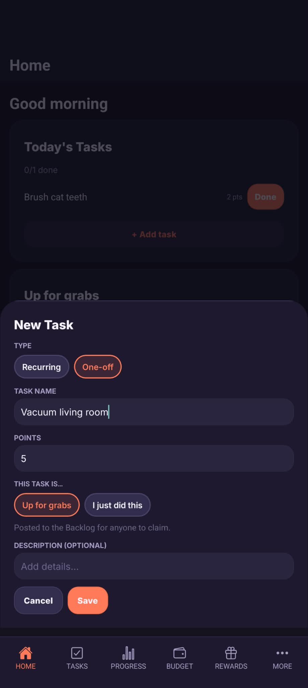
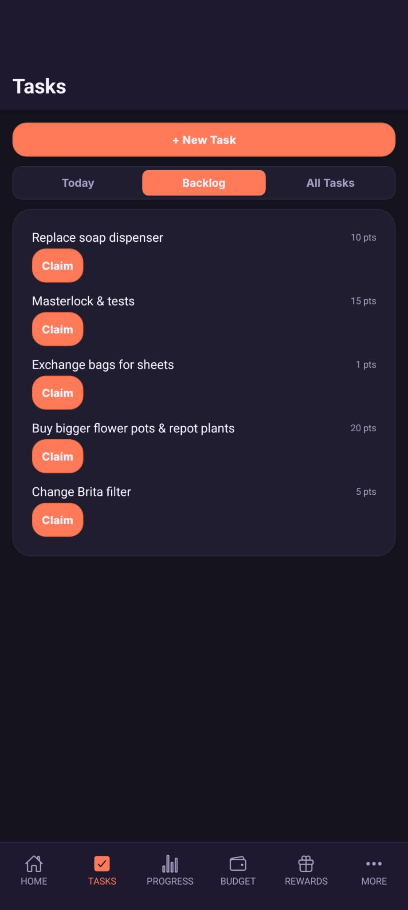
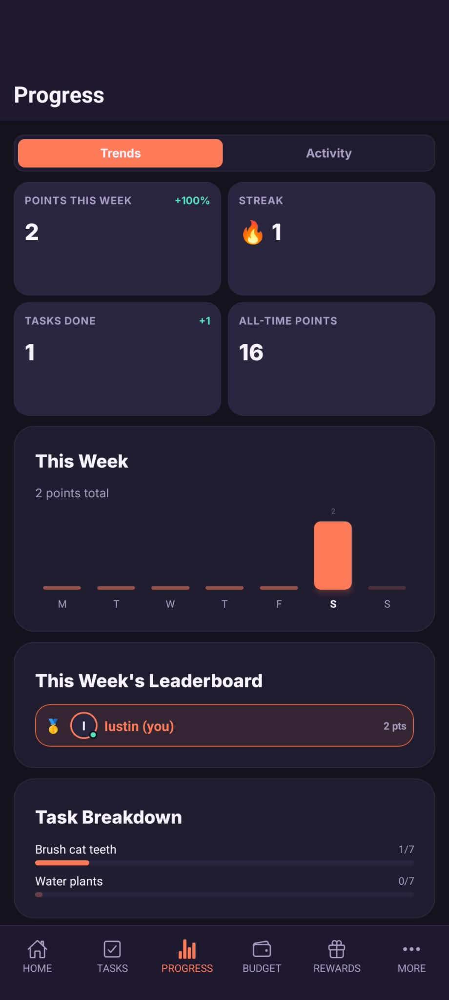
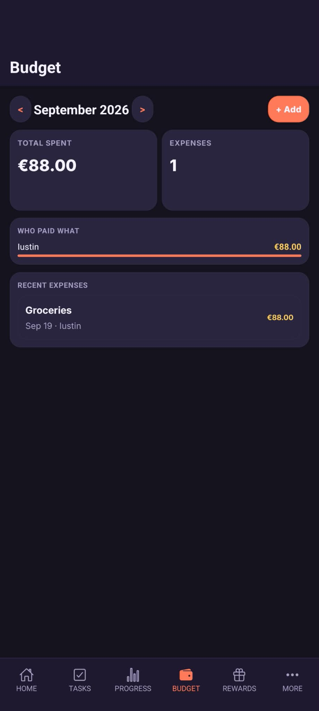
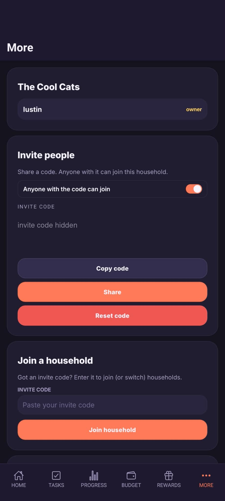

# Hiro

Chores become points, points become rewards, and the bills get split on the way.

Hiro is a household app for partners, families and housemates.
Post a chore up for grabs or log one you just did, earn the points your household agreed on, climb the weekly leaderboard, and spend points on rewards the household defines.
A shared budget tracks who paid what.

Built with Expo / React Native and Supabase, shipped natively via EAS to the Play internal track and TestFlight, and running in the author's own home.
Built with a fleet of coding agents; the repo doubles as a lab for agent-era engineering practice (see [AGENTS.md](AGENTS.md)).

## Screens

| Home and new task | Tasks backlog | Progress | Budget | Household |
| --- | --- | --- | --- | --- |
|  |  |  |  |  |

## For contributors and agents

### Canonical Architecture Rules

Architecture and engineering guardrails live in:

- [docs/architecture-standards.md](docs/architecture-standards.md)
- [docs/architecture/founder-qa-workflow.md](docs/architecture/founder-qa-workflow.md)

This file is mandatory for all contributors and agents.
Branch protection must require `quality` and `pr-governance` checks before merge.

### Workspace Layout

- `apps/mobile`
- `apps/web`
- `packages/domain`
- `packages/ui-tokens`
- `packages/ui-primitives`
- `packages/runtime`
- `packages/supabase-clients`
- `supabase`

### Common Commands

- `npm run dev:web`
- `npm run dev:mobile`
- `npm run dev --workspace @hiro/mobile -- --clear --tunnel`
- `npm run mobile:reset`
- `npm run lint`
- `npm run typecheck`
- `npm run test`
- `npm run check:boundaries`
- `npm run check:governance`
- `npm run check:expo-root-artifacts`
- `npm run check`

`npm run check` now prints an emoji/color quick summary and includes mobile runtime SDK preflight to catch Expo Go compatibility issues early.
Mobile runtime governance also fails when forbidden root Expo artifacts (`android`, `ios`, root `app.json`) are present or runtime package versions drift into unsafe combinations.
This workspace pins npm install behavior with `.npmrc` (`legacy-peer-deps=true`) to prevent peer auto-installs from introducing Expo SDK-incompatible native module majors.
