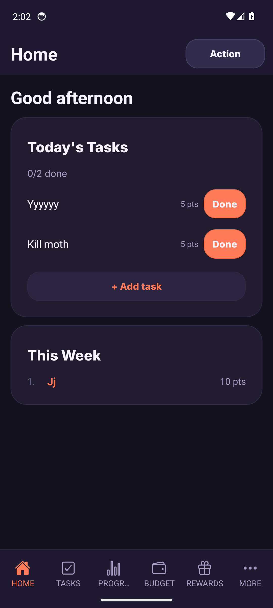

# Mobile QA harness (Android emulator)

This is the reusable harness v0.1.3 build agents use to **self-verify mobile work on a real Android runtime** - boot a headless emulator, launch the Hiro app, drive a flow, capture a screenshot - instead of relying on unit tests alone.

Set up once (see [Install recap](#install-recap)); every later agent just runs the [per-branch QA recipe](#per-branch-qa-recipe).

Proof it works: 
*(Hiro Home screen, themed, captured headless on the emulator via `node scripts/mobile-emulator.mjs screenshot home`.)*

---

## TL;DR for a feature agent

```bash
source scripts/android-env.sh                 # JAVA_HOME / ANDROID_HOME / PATH (user-local, no sudo)
node scripts/mobile-emulator.mjs boot         # headless AVD, waits for boot, sets adb reverse 8081
npm run dev:mobile                            # Metro from THIS checkout (loads .env). One Metro at a time.
node scripts/mobile-emulator.mjs launch       # opens com.hiro.app (already installed)
# ... drive the flow (see "Driving the UI") ...
node scripts/mobile-emulator.mjs screenshot my-check   # -> /tmp/hiro-mobile-qa/my-check.png
```

The Hiro debug APK is **built once** and reused across branches; switching branches only needs a Metro restart (JS is served live), not a rebuild.

---

## Helper script: `scripts/mobile-emulator.mjs`

Self-contained (sets its own `JAVA_HOME`/`ANDROID_HOME`/`PATH`, so it works without any shell config):

| Command | What it does |
|---|---|
| `boot` | Starts `hiro_pixel` headless (detached), waits for `sys.boot_completed`, sets `adb reverse tcp:8081`. No-op if already booted. |
| `status` | Prints whether an emulator is online + booted (exit 1 if not). |
| `reverse` | (Re)sets `adb reverse tcp:8081 tcp:8081` so the on-device app reaches Metro on `localhost`. |
| `launch` | Launches the installed app (`com.hiro.app`). |
| `screenshot <name>` | Writes `/tmp/hiro-mobile-qa/<name>.png`. |
| `logcat` | Tails RN/JS + native-crash logcat (Ctrl-C to stop). Use this to debug a blank screen. |
| `kill` | Shuts the emulator down. |

`scripts/android-env.sh` exports the same env for interactive `expo run:android` / `adb` / `emulator` use (`source scripts/android-env.sh`). **No `~/.zshrc` changes were made** - everything is explicit and repo-local.

---

## Install recap (done once on this box, user-local, no sudo)

Everything lives under `~/.local/share`; the only pre-existing system bits were `/usr/bin/adb` (overridden by the SDK's newer `adb` via PATH) and `/dev/kvm`.

| Component | Version (pinned) | Location |
|---|---|---|
| JDK | **Temurin OpenJDK 17.0.19+10** | `~/.local/share/jdk/temurin-17` |
| Android cmdline-tools | **build 13114758** (sdkmanager 19.0) | `$ANDROID_HOME/cmdline-tools/latest` |
| platform-tools (adb) | **37.0.0** | `$ANDROID_HOME/platform-tools` |
| Android Emulator | **36.6.11** | `$ANDROID_HOME/emulator` |
| Platform | **android-34** (rev 3) | `$ANDROID_HOME/platforms/android-34` |
| System image | **system-images;android-34;google_apis;x86_64** (rev 14) | `$ANDROID_HOME/system-images/...` |
| AVD | `hiro_pixel` (pixel_6 profile, x86_64) | `~/.android/avd/hiro_pixel.avd` |

`ANDROID_HOME=/home/iustin/.local/share/Android/Sdk`.

**Auto-installed by the first Gradle build** (the native project compiles against API 36 + native libs): build-tools `35.0.0` + `36.0.0`, platform `android-36`, NDK `27.1.12297006`, CMake `3.22.1`. Expect these on a clean re-setup.

### Reproduce from scratch
```bash
# 1. JDK
mkdir -p ~/.local/share/jdk && cd ~/.local/share/jdk
curl -fL -o j.tgz "https://api.adoptium.net/v3/binary/latest/17/ga/linux/x64/jdk/hotspot/normal/eclipse"
tar xzf j.tgz && mv jdk-17* temurin-17 && rm j.tgz

# 2. Android cmdline-tools
export ANDROID_HOME=~/.local/share/Android/Sdk
mkdir -p "$ANDROID_HOME/cmdline-tools" && cd "$ANDROID_HOME/cmdline-tools"
curl -fL -o c.zip "https://dl.google.com/android/repository/commandlinetools-linux-13114758_latest.zip"
unzip -q c.zip && mv cmdline-tools latest && rm c.zip

# 3. SDK packages
source <repo>/scripts/android-env.sh
yes | sdkmanager --licenses
sdkmanager "platform-tools" "platforms;android-34" "system-images;android-34;google_apis;x86_64" "emulator"

# 4. AVD
avdmanager create avd -n hiro_pixel -k "system-images;android-34;google_apis;x86_64" -d pixel_6
```

### Cost (measured on this box: 24 cores, 62 GB RAM, /dev/kvm present)
- **KVM hardware accel: works** (`KVM (version 12) is installed and usable`). The user is already in the `kvm` group. If a future box can't open `/dev/kvm`, add the user to the `kvm` group and relog.
- **Boot time:** ~26s cold, ~8s warm (KVM-accelerated, headless).
- **First `expo run:android` build:** ~3m28s Gradle + install (one-time; subsequent JS-only changes need no rebuild).
- **Disk:** JDK ~0.32 GB; Android SDK ~7.8 GB after the first build (incl. NDK/CMake/build-tools/android-36 pulled in by Gradle). Budget ~9 GB total.

---

## App-delivery path (the decision)

**Chosen: a local debug build via `expo run:android`, JS served by Metro, reused across branches.**

- `apps/mobile/android/` is committed (prebuild already run), so `cd apps/mobile && npx expo run:android` compiles the native project to a debug APK, installs it, and loads JS from Metro. Build the APK **once**; feature branches only restart Metro.
- This debug build is a **real dev build with the app's native code baked in** - NOT Expo Go. That matters for **F3 (push notifications)**: `expo-notifications` native config cannot run under Expo Go, but it runs fine in this build. (`expo-dev-client` is not currently a dependency; the plain debug build still hosts native modules and connects to Metro, which is all the harness needs. If F3 wants the dev-client launcher UI specifically, add `expo-dev-client` then - separate change.)
- **Metro reaches the device via `adb reverse tcp:8081`** (set by `boot`). Run **one Metro at a time** on port 8081; to QA a different worktree, stop the old Metro and start it from the new checkout.

### Package id: `com.behiro.app`
`apps/mobile/android/` is **gitignored** - it's a local `expo prebuild` artifact, not committed. The id source of truth is `app.json` (`android.package` and `ios.bundleIdentifier`), both **`com.behiro.app`** - the same id used in the Apple App Store and Google Play. The harness targets `com.behiro.app`.

If a stale local prebuild ever installs the app under a different id, regenerate the native dir from `app.json`:
```bash
cd apps/mobile && npx expo prebuild --clean -p android
```
(A previous local prebuild had drifted to `com.hiro.app`; `prebuild --clean` realigned it.)

---

## Per-branch QA recipe

For QAing a feature branch in an isolated worktree (the standard per-item dispatch flow):

```bash
# 1. Worktree + its gitignored env (see project memory: worktree_env_files)
git worktree add ../hiro-<branch> <branch>
cp /home/iustin/dev/hiro/apps/mobile/.env ../hiro-<branch>/apps/mobile/.env

# 2. Boot the emulator (shared across worktrees - the APK is already installed)
cd /home/iustin/dev/hiro            # script lives in main checkout; works from anywhere
node scripts/mobile-emulator.mjs boot

# 3. Metro from the WORKTREE (one Metro at a time on 8081; restart so EXPO_PUBLIC_* reload)
cd ../hiro-<branch> && npm run dev:mobile
#   (if Metro was already running for another checkout, stop it first - stale env otherwise)

# 4. Launch + reload + drive + screenshot
node /home/iustin/dev/hiro/scripts/mobile-emulator.mjs launch
#   reload JS: press 'r' in the Metro terminal, or `adb shell input text "RR"` is NOT reliable -
#   prefer Metro's `r`. The app picks up the worktree's bundle.
node /home/iustin/dev/hiro/scripts/mobile-emulator.mjs screenshot <branch>-<flow>
```

If the app shows a **blank/black screen**, it's almost always a missing `.env` in the worktree (env validation throws at module load before render). Run `node scripts/mobile-emulator.mjs logcat` and look for `validateRuntimeEnv` / `SES_UNCAUGHT_EXCEPTION`. Fix: copy `.env`, restart Metro (step 1/3).

### Reaching gated screens (auth + onboarding)
Home/Tasks/etc. are behind auth **and** onboarding (a user is "onboarded" only with a household membership **and** a non-empty display name - see `RootNavigator.tsx`). To land on Home:

1. Use an existing onboarded test account. `mobile@test.com` is a purpose-built mobile QA account (display "Jj", in a household with sample tasks).
2. Its password can be (re)set via Supabase admin (no email round-trip needed):
   ```sql
   update auth.users
   set encrypted_password = crypt('<password>', gen_salt('bf')),
       email_confirmed_at = coalesce(email_confirmed_at, now())
   where email = 'mobile@test.com';
   ```
   (Project `pfokfopwjrahclmseper`; do this via the Supabase MCP `execute_sql`. Don't commit the password.)
3. Sign in through the UI; the session persists in SecureStore, so later `launch` calls re-land on Home directly.

### Driving the UI from the shell
`adb shell input tap/text` works, but **fixed coordinates break when the keyboard opens** (the layout shifts). The reliable pattern is to read live element bounds:

```bash
adb shell uiautomator dump /sdcard/ui.xml && adb pull /sdcard/ui.xml
# parse <node ... bounds="[x1,y1][x2,y2]"> for the target, tap its center
adb shell input tap <cx> <cy>
adb shell input text "..."          # type into the focused field
adb shell input tap 114 2324        # the keyboard-dismiss chevron (bottom-left) - do NOT use KEYCODE_BACK
```
`KEYCODE_BACK` at the auth root **exits the app** - use the keyboard-dismiss chevron or tap a neutral area instead.

---

## Files
- `scripts/mobile-emulator.mjs` - the harness driver
- `scripts/android-env.sh` - sourceable env for manual SDK/Gradle use
- `docs/v0.1.3/assets/mobile-qa-home-proof.png` - proof screenshot (themed Home, captured headless)
